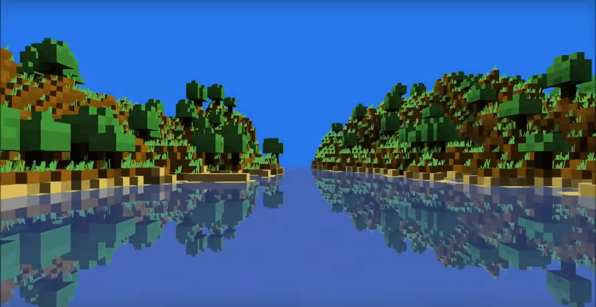

# School Pascal Programs

В этом репозитории вы найдете программы на Pascal и Pascal ABC.NET, которые я писал во время обучения в школе в качестве развлечения в свободное время (с 2011 по 2016 год).

Еще больше моих программ на Pascal вы можете найти в моей старой группе VK [Pascal ABC.NET
](https://vk.com/sfinp)

## Программы

- [Evolveсraft](./Evolvecraft/) - генератор миров в стиле Minecraft и реалистичный рендер
- [История](./History/) - симуляция в духе игры "Казаки"
- [Арена](./Arena/) - текстовая игра в жанре фэнтези
- [Машинки](./Traffic/) - игра в стиле Subway surfer
- [Музыка](./Music/) - проигрыватель в духе синтезатора мелодий на старых Nokia
- [Прямохождение](./Bipedalism/) - симуляция обучения робота прямохождению

## [Эволвкрафт](./Evolvecraft/)

Скриншот наиболее сложной из созданных мной программ на Pascal.

